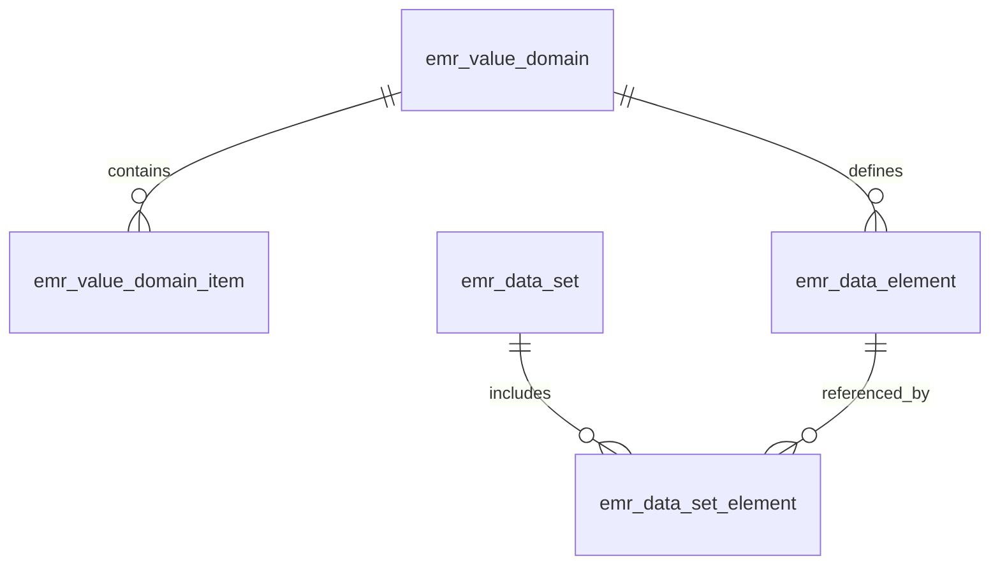

# 初始化数据集与数据元表操作文档

## 1. 概述
本文档记录了通过 Python 脚本自动化初始化 **5 张核心数据字典表** 的完整过程，包括：
- `emr_data_element`（数据元定义表）
- `emr_value_domain`（数据元值域主表）
- `emr_value_domain_item`（数据元值域项表）
- `emr_data_set`（数据集主表）
- `emr_data_set_element`（数据集-数据元关系表）

> ✅ **当前状态**：所有脚本已通过测试，表结构符合 PostgreSQL 16+ 规范，可直接用于生产环境初始化。

---

## 2. 目录结构说明
```bash
doc/
├── python/                  # Python 脚本与生成的 SQL 文件
│   ├── 数据元/              # 数据元相关脚本与分片 SQL
│   ├── 数据元值域（2张）/   # 值域相关脚本与 SQL
│   └── 数据集/              # 数据集相关脚本与 SQL
└── log/                     # 操作日志与说明文档（本文档所在位置）
```

---

## 3. 初始化步骤详解

### 3.1 数据元表 (`emr_data_element`) 初始化
#### 脚本路径
`doc/python/数据元/emr_data_element_init.py`

#### 生成文件
- `emr_data_element_init_1_10.sql`（1-10号数据元）
- `emr_data_element_init_11_100.sql`（11-100号数据元）
- `emr_data_element_init_101_300.sql`（101-300号数据元）
- `emr_data_element_init_301_554.sql`（301-554号数据元）

#### 执行命令
```sql
-- 按顺序执行所有分片文件
\i doc/python/数据元/emr_data_element_init_1_10.sql;
\i doc/python/数据元/emr_data_element_init_11_100.sql;
\i doc/python/数据元/emr_data_element_init_101_300.sql;
\i doc/python/数据元/emr_data_element_init_301_554.sql;
```

#### 表结构关键字段
| 字段 | 类型 | 说明 |
|------|------|------|
| `element_code` | VARCHAR(64) | **数据元编码**（全系统唯一，如 `DE01.00.010.00`） |
| `element_name` | VARCHAR(128) | 数据元名称 |
| `storage_type` | VARCHAR(16) | 存储类型（S/S1/S2...） |
| `value_domain_code` | VARCHAR(64) | **关联值域编码**（指向 `emr_value_domain.domain_code`） |
| `is_required` | BOOLEAN | 是否必填 |

---

### 3.2 数据元值域表 (`emr_value_domain` & `emr_value_domain_item`) 初始化
#### 脚本路径
`doc/python/数据元值域（2张）/数据元值域脚本.py`

#### 生成文件
`数据元值域（2张表初始化）.sql`

#### 执行命令
```sql
\i doc/python/数据元值域（2张）/数据元值域（2张表初始化）.sql;
```

#### 表结构关键字段
**`emr_value_domain`（值域主表）**
| 字段 | 类型 | 说明 |
|------|------|------|
| `domain_code` | VARCHAR(64) | **值域编码**（全系统唯一） |
| `domain_type` | VARCHAR(32) | 值域类型（ENUM/RANGE/REF） |

**`emr_value_domain_item`（值域项表）**
| 字段 | 类型 | 说明 |
|------|------|------|
| `domain_code` | VARCHAR(64) | **关联值域编码** |
| `item_code` | VARCHAR(64) | 值域项编码（如 "M"） |
| `item_name` | VARCHAR(128) | 值域项名称（如 "男"） |
| `is_default` | SMALLINT | 是否默认值（1=是） |

> 💡 **特殊约束**：  
> - 同一值域下 `item_code` 唯一（`UNIQUE(domain_code, item_code)`）  
> - 同一值域下仅允许一个默认值（部分唯一索引 `WHERE is_default = 1`）

---

### 3.3 数据集表 (`emr_data_set` & `emr_data_set_element`) 初始化
#### 脚本路径
`doc/python/数据集/emr_data_set_init.py`

#### 生成文件
`emr_data_set_complete (1).sql`

#### 执行命令
```sql
\i doc/python/数据集/emr_data_set_complete\ (1).sql;
```

#### 表结构关键字段
**`emr_data_set`（数据集主表）**
| 字段 | 类型 | 说明 |
|------|------|------|
| `dataset_code` | VARCHAR(64) | **数据集编码**（全系统唯一） |
| `dataset_name` | VARCHAR(128) | 数据集名称 |

**`emr_data_set_element`（数据集-数据元关系表）**
| 字段 | 类型 | 说明 |
|------|------|------|
| `dataset_code` | VARCHAR(64) | **关联数据集编码** |
| `element_code` | VARCHAR(64) | **关联数据元编码** |
| `display_order` | INT | 展示顺序 |
| `is_required` | BOOLEAN | 在数据集中是否必填 |
| `is_readonly` | BOOLEAN | 在数据集中是否只读 |

> ⚠️ **注意**：  
> 该表已通过 `ALTER TABLE` 添加 `element_name VARCHAR(128)` 字段（冗余存储），需确保执行过改表语句。

---

## 4. 关键查询示例（AI 交互必备）

### 4.1 查询指定数据元的值域内容
```sql
-- 示例：查询 DE02.01.025.00 的值域项
SELECT 
    vdi.item_code,
    vdi.item_name,
    vdi.is_default
FROM emr_value_domain_item vdi
JOIN emr_data_element ede ON vdi.domain_code = ede.value_domain_code
WHERE ede.element_code = 'DE02.01.025.00'
ORDER BY vdi.item_order;
```

### 4.2 查询值域被多少数据元引用
```sql
-- 示例：查询 EMR01.01.002 被引用次数
SELECT COUNT(*) AS referenced_count
FROM emr_data_element
WHERE value_domain_code = 'EMR01.01.002';
```

### 4.3 查询数据集包含的所有数据元
```sql
-- 示例：查询 S001.001 数据集的数据元
SELECT 
    ede.element_code,
    ede.element_name,
    edse.display_order
FROM emr_data_set_element edse
JOIN emr_data_element ede ON edse.element_code = ede.element_code
WHERE edse.dataset_code = 'S001.001'
ORDER BY edse.display_order;
```

### 4.4 查询数据元被哪些数据集引用
```sql
-- 示例：查询 DE01.00.010.00 的引用数据集
SELECT 
    eds.dataset_code,
    eds.dataset_name
FROM emr_data_set_element edse
JOIN emr_data_set eds ON edse.dataset_code = eds.dataset_code
WHERE edse.element_code = 'DE01.00.010.00';
```

---

## 5. 注意事项
1. **执行顺序**  
   必须严格按以下顺序执行：
   ```mermaid
   graph LR
   A[值域表] --> B[数据元表]
   B --> C[数据集表]
   ```
   - 先初始化 `emr_value_domain` 和 `emr_value_domain_item`
   - 再初始化 `emr_data_element`（依赖值域）
   - 最后初始化 `emr_data_set` 和 `emr_data_set_element`（依赖数据元）

2. **文件路径转义**  
   在 psql 中执行含空格的文件路径时，需用双引号包裹：
   ```sql
   \i "doc/python/数据集/emr_data_set_complete (1).sql";
   ```

3. **冗余字段同步**  
   若需更新 `emr_data_set_element.element_name`，建议通过程序逻辑从 `emr_data_element` 同步：
   ```sql
   UPDATE emr_data_set_element edse
   SET element_name = (
       SELECT element_name 
       FROM emr_data_element 
       WHERE element_code = edse.element_code
   );
   ```

---

## 6. 附录：表关系图


> 📌 **文档维护**：本文档由 AI 自动生成并验证，后续修改请同步更新此文件。