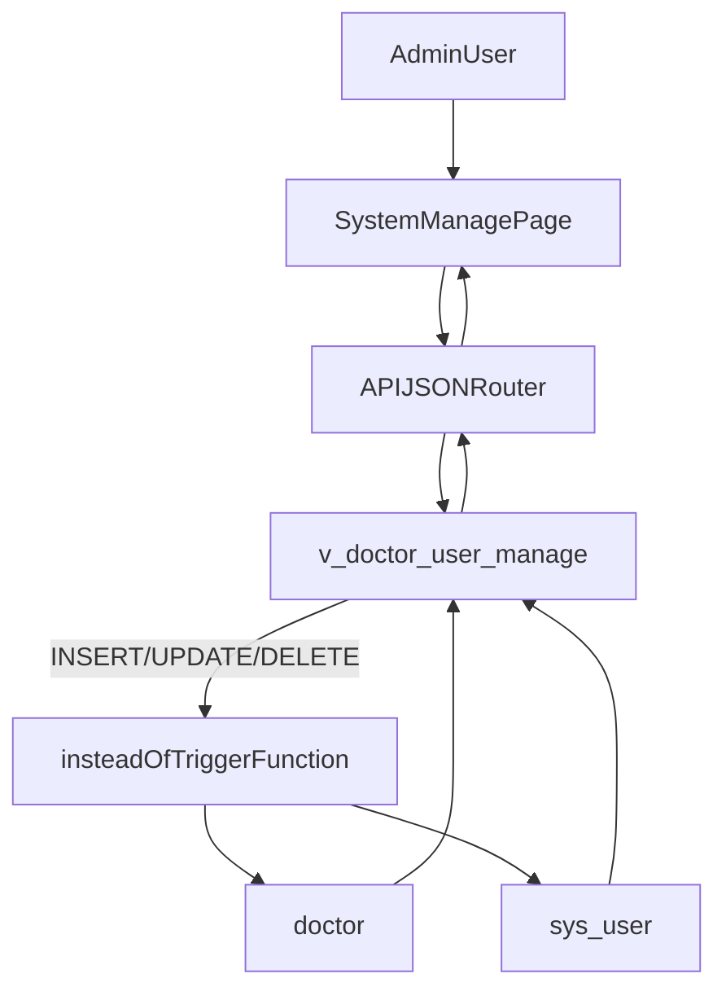

# 医生管理与系统用户联动实施计划

## 1) 现状确认与设计边界

- 已确认真实结构（public schema）：
  - `doctor`：`doctor_code` 唯一，`user_username` 唯一且外键指向 `sys_user.username`，软删字段为 `enabled`。
  - `sys_user`：`username` 唯一，软删字段为 `is_deleted`，登录校验走 Spring `BCryptPasswordEncoder.matches()`。
- 你的确认已纳入方案：
  - 密码由前端先加密后传入（沿用现有可登录格式）。
  - 编辑时不允许改用户名（`username/user_username` 只在新增时写入，编辑只改医生信息与密码）。

## 2) 数据库对象设计（视图 + INSTEAD OF 触发器）

- 新建可更新视图（建议名）：`public.v_doctor_user_manage`。
- 视图字段（面向页面与 APIJSON）：
  - 主键与定位：`doctor_id`, `user_id`
  - 业务标识：`doctor_code`, `doctor_name`, `dept_code`, `title_code`, `license_no`
  - 账号信息：`username`, `password`（仅用于写入；查询时返回 `NULL` 或掩码）
  - 状态字段：`doctor_enabled`, `user_status`, `user_is_deleted`
  - 审计字段：`doctor_create_time`, `doctor_update_time`, `user_create_time`, `user_update_time`
- 建议 SQL 关系：`doctor d JOIN sys_user u ON u.username = d.user_username`。

### 触发器函数行为（核心）

- 触发器类型：`INSTEAD OF INSERT OR UPDATE OR DELETE ON v_doctor_user_manage`。
- `INSERT` 路径（新增医生+账号，一次请求落两表）
  - 前置校验：`doctor_code/username/password/doctor_name/dept_code` 非空。
  - 顺序：
    1. `INSERT sys_user(username, password, name, status, is_deleted, create_time, update_time)`
      - `password` 直接写入前端加密串；`name` 默认用 `doctor_name`；`status` 默认 `1`；`is_deleted` 默认 `0`。
    2. `INSERT doctor(doctor_code, doctor_name, dept_code, title_code, license_no, user_username, enabled, create_time, update_time)`
      - `user_username = username`，`enabled` 默认 `true`。
  - 返回：`RETURN NEW`（或回填 `doctor_id/user_id` 后返回）。
- `UPDATE` 路径（联动修改）
  - 锁定规则：通过 `OLD.doctor_id`（或 `OLD.doctor_code`）定位医生记录；用户名不可变：若 `NEW.username <> OLD.username` 则抛错。
  - 更新 `doctor`：
    - 可改：`doctor_name/dept_code/title_code/license_no/enabled`
    - `update_time = CURRENT_TIMESTAMP`
  - 更新 `sys_user`：
    - 可改：`name`（同步医生名）、`status`（可选映射）、`password`（仅 `NEW.password` 非空时更新）
    - `update_time = CURRENT_TIMESTAMP`
  - 返回：`RETURN NEW`。
- `DELETE` 路径（按你的要求改为软删）
  - 不做物理删除：
    - `UPDATE doctor SET enabled = false, update_time = CURRENT_TIMESTAMP WHERE id = OLD.doctor_id;`
    - `UPDATE sys_user SET is_deleted = 1, update_time = CURRENT_TIMESTAMP WHERE id = OLD.user_id;`
  - 返回：`RETURN OLD`。
- 并发/一致性建议
  - 触发器函数内天然在同一事务中执行；任一步失败整体回滚。
  - 对重复键（`doctor_code`/`username`）抛明确错误信息，便于前端提示。

## 3) APIJSON 接入计划

- 新增 Access 配置：为视图 `v_doctor_user_manage` 增加 alias（建议 `DoctorUserManage`），权限仅 `ADMIN` 读写。
- 可选新增 Request 结构约束：
  - `POST`：强制必填字段（医生编码、姓名、科室、用户名、密码）。
  - `PUT`：禁止修改 `username`，仅允许可变字段。
  - `DELETE`：仅允许按 `doctor_id`/`doctor_code` 删除。
- 后端兜底鉴权：扩展 `DemoController` 当前 Patient 的 ADMIN 写保护逻辑，对 `DoctorUserManage` 的 `post/put/delete` 同样做管理员校验，防止 APIJSON 角色识别抖动时越权。

## 4) 前端页面计划（系统管理菜单内，风格对齐患者管理）

- 把占位页替换为实际列表页：
  - 文件：[CCY_EMR_UI/src/pages/System/index.tsx](CCY_EMR_UI/src/pages/System/index.tsx)
- 页面交互与患者管理一致：
  - `ProTable + ModalForm`，支持查询、新建、编辑、删除。
  - 列表读取视图 alias（`DoctorUserManage[]`），展示关键字段：医生编码、姓名、科室、职称、执业证号、用户名、医生启用状态、用户状态。
  - 新增：提交 `apijson.post` 到视图 alias，一次完成两表插入。
  - 编辑：提交 `apijson.put`，密码为空则不更新，非空则覆盖为新加密串。
  - 删除：提交 `apijson.delete`，由触发器执行双表软删。
- 页面权限：沿用患者管理页做法，仅管理员可进入；非管理员返回 403 结果页。

## 5) 数据流（实现后）

## 6) 计划修改点（文件级）

- SQL（新增迁移脚本，建议）：
  - [doc/sql/doctor_user_manage_view.sql](doc/sql/doctor_user_manage_view.sql)
    - 创建/替换视图
    - 创建触发器函数
    - 创建 INSTEAD OF 触发器
    - 写入 Access/Request 配置（幂等）
- 后端鉴权兜底：
  - [src/main/java/com/ccy/emr/apijson/DemoController.java](src/main/java/com/ccy/emr/apijson/DemoController.java)
- 前端系统管理页：
  - [CCY_EMR_UI/src/pages/System/index.tsx](CCY_EMR_UI/src/pages/System/index.tsx)
  - 如需样式，再补充 [CCY_EMR_UI/src/pages/System/index.less](CCY_EMR_UI/src/pages/System/index.less)

## 7) 验证用例（执行阶段会逐条自测）

- 新增：提交一个新医生+新账号，验证两表各新增1条。
- 编辑：修改医生信息且不填密码（仅 doctor/sys_user 非密码字段变化）。
- 编辑密码：提交新加密密码串，登录接口可成功验证。
- 删除：调用 delete 后，`doctor.enabled=false` 且 `sys_user.is_deleted=1`。
- 权限：非 ADMIN 调用写接口被拒绝；页面展示 403。

