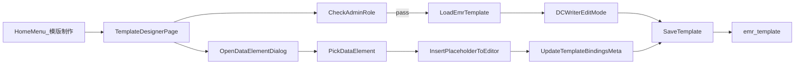

# 模版制作页面（替换住院医生站）设计方案

## 目标与边界

- 替换首页“住院医生站”为“模版制作”，并将路由命名同步替换（按你确认的“直接替换”方式）。
- 页面整体风格保持现有站点风格（header、返回首页、用户信息等一致）。
- 仅管理员可进入和保存模板。
- 使用 DCWriter 的编辑模式（非只读），并展示工具栏。
- 保存目标表为 `emr_template`（已存在，不新建表）。
- 第一阶段先支持“弹窗插入数据元”；拖拽插入作为第二阶段扩展。

## 现状分析（已结合代码与数据库）

- 路由与菜单：当前“住院医生站”在 `[/Users/ccy/Desktop/毕业设计/毕业设计项目资料代码/CCY_EMR_SERVICE/CCY_EMR_UI/.umirc.ts](/Users/ccy/Desktop/毕业设计/毕业设计项目资料代码/CCY_EMR_SERVICE/CCY_EMR_UI/.umirc.ts)` 配置为 `/inpatient`，首页卡片在 `[/Users/ccy/Desktop/毕业设计/毕业设计项目资料代码/CCY_EMR_SERVICE/CCY_EMR_UI/src/pages/Home/index.tsx](/Users/ccy/Desktop/毕业设计/毕业设计项目资料代码/CCY_EMR_SERVICE/CCY_EMR_UI/src/pages/Home/index.tsx)`。
- DCWriter 接入：现有门诊页已能加载 DCWriter（脚本、`CreateWriterControlForWASM`、`LoadDocumentFromString`、读写切换），可复用核心初始化逻辑，见 `[/Users/ccy/Desktop/毕业设计/毕业设计项目资料代码/CCY_EMR_SERVICE/CCY_EMR_UI/src/pages/Outpatient/MedicalEditor.tsx](/Users/ccy/Desktop/毕业设计/毕业设计项目资料代码/CCY_EMR_SERVICE/CCY_EMR_UI/src/pages/Outpatient/MedicalEditor.tsx)`。
- 权限基础：前端已通过 `initialState.currentUser.roles` 与 `username==='admin'` 判断管理员，可沿用。参考 `[/Users/ccy/Desktop/毕业设计/毕业设计项目资料代码/CCY_EMR_SERVICE/CCY_EMR_UI/src/app.ts](/Users/ccy/Desktop/毕业设计/毕业设计项目资料代码/CCY_EMR_SERVICE/CCY_EMR_UI/src/app.ts)`。
- 数据元基础：标准数据管理页已具备数据集、数据元、值域查询能力，可抽取查询逻辑复用，见 `[/Users/ccy/Desktop/毕业设计/毕业设计项目资料代码/CCY_EMR_SERVICE/CCY_EMR_UI/src/pages/Data/components/DatasetView.tsx](/Users/ccy/Desktop/毕业设计/毕业设计项目资料代码/CCY_EMR_SERVICE/CCY_EMR_UI/src/pages/Data/components/DatasetView.tsx)` 与 `[/Users/ccy/Desktop/毕业设计/毕业设计项目资料代码/CCY_EMR_SERVICE/CCY_EMR_UI/src/pages/Data/components/ElementView.tsx](/Users/ccy/Desktop/毕业设计/毕业设计项目资料代码/CCY_EMR_SERVICE/CCY_EMR_UI/src/pages/Data/components/ElementView.tsx)`。

## PostgreSQL 结构结论（MCP 实查）

- `emr_template` 关键字段：`template_code`(唯一)、`template_name`、`emr_type`、`template_scope`、`template_structure(jsonb)`、`enabled`、时间戳。
- 当前库内 `emr_template` 约有 1 条数据（`OUTPATIENT_JSONB_XML_DEMO`），`template_structure` 中已存 `{ "xml": "..." }` 结构，符合“将 DCWriter 文档放入 jsonb”做法。
- 数据元相关体量：`emr_data_element` 约 5537 条、`emr_data_set` 约 59 条、`emr_data_set_element` 约 2221 条，支持构建“数据集-数据元”树。

## 页面与交互设计

- 新页面：`TemplateDesigner`（替代原 Inpatient 页面）
  - 顶部：与现有业务页一致（系统名、当前用户、返回首页）。
  - 主体左右布局：
    - 左：数据元插入区（阶段一先按钮+弹窗，阶段二改树+拖拽）。
    - 右：DCWriter 编辑区（编辑模式、工具栏可见）。
  - 顶部操作栏：`新建`、`保存`、`另存为`、`启用/停用`、`预览`。
- 阶段一插入方式（你已选择）：
  - 点击“插入数据元”打开弹窗；弹窗支持按数据集/名称检索数据元。
  - 选择后生成占位标记并插入编辑器（如 `${DE02.01.039.00|姓名}` 或约定的 XML 节点标记）。
  - 同步记录 `template_structure.meta.bindings`（数据元编码、名称、类型、值域、默认值等）。
- 阶段二拖拽方式：
  - 左侧树：一级数据集、二级数据元。
  - 拖拽到编辑器后，调用同一插入逻辑，保持和弹窗插入的数据结构一致。

## 权限与数据保存设计

- 前端访问控制：
  - 非管理员进入“模版制作”直接返回 403（与系统管理页做法一致）。
  - 保存按钮仅管理员可见/可用。
- 保存模型（落到 `emr_template`）：
  - `template_structure` 统一保存为：
    - `xml`: 当前 DCWriter 导出的文档字符串。
    - `meta`: `{ editor: 'dcwriter5', mode: 'edit', bindings: [...], version: '1.0' }`。
  - 新建：APIJSON `post EmrTemplate`。
  - 编辑：APIJSON `put EmrTemplate`（按 `id` 或 `template_code`）。
  - 兼容读取：优先读 `template_structure.xml`，并兼容历史字符串结构。

## 技术实现落点（文件级）

- 路由/菜单替换：
  - `[/Users/ccy/Desktop/毕业设计/毕业设计项目资料代码/CCY_EMR_SERVICE/CCY_EMR_UI/.umirc.ts](/Users/ccy/Desktop/毕业设计/毕业设计项目资料代码/CCY_EMR_SERVICE/CCY_EMR_UI/.umirc.ts)`
  - `[/Users/ccy/Desktop/毕业设计/毕业设计项目资料代码/CCY_EMR_SERVICE/CCY_EMR_UI/src/pages/Home/index.tsx](/Users/ccy/Desktop/毕业设计/毕业设计项目资料代码/CCY_EMR_SERVICE/CCY_EMR_UI/src/pages/Home/index.tsx)`
- 页面容器与权限门禁：
  - `[/Users/ccy/Desktop/毕业设计/毕业设计项目资料代码/CCY_EMR_SERVICE/CCY_EMR_UI/src/pages/Inpatient/index.tsx](/Users/ccy/Desktop/毕业设计/毕业设计项目资料代码/CCY_EMR_SERVICE/CCY_EMR_UI/src/pages/Inpatient/index.tsx)`（改为模板制作页）
- DCWriter 编辑器复用与增强：
  - 复用并裁剪 `[/Users/ccy/Desktop/毕业设计/毕业设计项目资料代码/CCY_EMR_SERVICE/CCY_EMR_UI/src/pages/Outpatient/MedicalEditor.tsx](/Users/ccy/Desktop/毕业设计/毕业设计项目资料代码/CCY_EMR_SERVICE/CCY_EMR_UI/src/pages/Outpatient/MedicalEditor.tsx)` 初始化逻辑
  - 新增模板编辑器组件（建议 `src/pages/Inpatient/components/TemplateEditor.tsx`）
- API 层：
  - 在 `[/Users/ccy/Desktop/毕业设计/毕业设计项目资料代码/CCY_EMR_SERVICE/CCY_EMR_UI/src/api/outpatient.ts](/Users/ccy/Desktop/毕业设计/毕业设计项目资料代码/CCY_EMR_SERVICE/CCY_EMR_UI/src/api/outpatient.ts)` 抽离模板 API，或新增 `src/api/template.ts`
  - 复用 `apijson` 客户端 `[/Users/ccy/Desktop/毕业设计/毕业设计项目资料代码/CCY_EMR_SERVICE/CCY_EMR_UI/src/api/apijson.ts](/Users/ccy/Desktop/毕业设计/毕业设计项目资料代码/CCY_EMR_SERVICE/CCY_EMR_UI/src/api/apijson.ts)`

## 数据流（阶段一）

## 验收标准

- 首页原“住院医生站”入口文案与跳转已替换为“模版制作”。
- 进入页面后 DCWriter 为编辑态且可见工具栏。
- 非管理员访问被拦截（403）。
- 管理员可保存模板到 `emr_template.template_structure`，并可回显编辑。
- 可通过“弹窗选择数据元”插入占位标记并保存绑定元数据。

