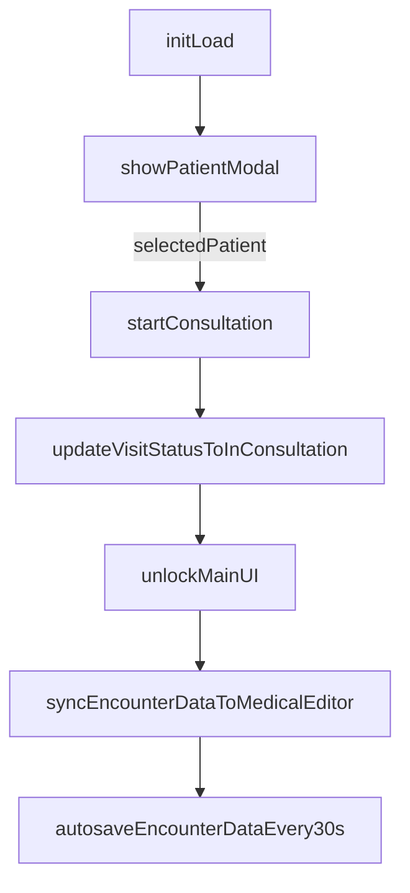

# 门诊医生站原型系统计划与设计

## 目标对齐与技术选型

- 前端沿用现有栈：React + Umi Max + Ant Design 5（当前项目已是该栈）。
- 左右拖拽分栏按你选择采用第三方 splitter 组件（避免升级 antd 版本风险）。
- DCWriter 按你提供的 React 集成步骤设计：`Promise.all` 脚本加载 -> `dctype="WriterControlForWASM"` + `autoCreateControl="false"` -> `EventBeforeCreateControl` -> `window.CreateWriterControlForWASM` -> `LoadDocumentFromString`。

## 现有代码落点

- 当前门诊页是占位页，需整体替换：[CCY_EMR_UI/src/pages/Outpatient/index.tsx](CCY_EMR_UI/src/pages/Outpatient/index.tsx)
- 现有全局请求与 APIJSON 封装可直接复用：[CCY_EMR_UI/src/utils/request.ts](CCY_EMR_UI/src/utils/request.ts)、[CCY_EMR_UI/src/api/index.ts](CCY_EMR_UI/src/api/index.ts)
- 当前数据库状态机已具备“待就诊 -> 就诊中 -> 完成”约束：[doc/sql/outpatient_visit_active_history_migration.sql](doc/sql/outpatient_visit_active_history_migration.sql)、[doc/sql/outpatient_visit_active_history_runbook.md](doc/sql/outpatient_visit_active_history_runbook.md)
- 数据库结构可以直接通过pgsql MCP访问去查看数据库表结构，这里面的关键点就是待就诊的患者列表，也就是outpatient_visit_active表，还有患者信息表patient表，还有outpatient_encounter_data表，会存放所有诊疗过程中的信息，使用的是JSONB的结构，右侧是DCWriter的模版，也就是emr_template里面会存储模版信息，默认加载这个模版，然后后续解决数据填充的问题

## 页面与组件分层设计

- `OutpatientWorkbench`（页面容器）：管理全局状态、初始化拦截、顶部三层布局。
- `SystemHeader`（第一层）：Logo/系统名、医生信息、系统时间、返回首页。（和患者信息管理的header一样就可以）
- `PatientContextBar`（第二层）：
  - 左：当前患者核心档案（姓名/性别/年龄/就诊号）+ 打开“患者列表”。
  - 右：`保存`/`签署`/`结算`/`打印`（实色按钮）。
  - 背景采用医疗蓝系（默认 `#e6f7ff` 到 `#0050b3` 渐变）并与第一层形成强分区。
- `MainLayout`（第三层）：45:55 初始比例 + 可拖拽 splitter。
  - 左：`EncounterAccordion`（主诉/病史/处方/检查）
  - 右：`MedicalEditor`（DCWriter 适配层）

## 关键状态模型（前端）

- `selectedPatient`: 当前就诊患者（未选中时为 `null`）。
- `visitStatus`: `REGISTERED | IN_CONSULTATION | COMPLETED`（与库状态机对齐）。
- `encounterData`: 主诉/病史/处方/检查的结构化对象（页面单一事实源）。
- `editorMode`: `edit | readonly`（历史签署病历进入 readonly）。
- `uiGate`: `blocking | ready`（控制初始拦截与骨架/模糊态）。

## 交互流程控制设计

- 页面首次进入：强制弹出“待就诊患者列表 Modal”。
- 未选择患者前：主业务区显示 `Skeleton` + `blur` 覆盖，所有交互禁用。
- 选择患者后：
  - 调用 API 将状态置为 `IN_CONSULTATION`。
  - 顶栏主题从中性灰切到医疗蓝，提供“开始接诊”视觉暗示。
  - 加载对应 encounter 数据并解除拦截态。

## 左侧互斥录入设计

- Accordion 使用手风琴模式（同一时刻仅展开一个面板）。
- `主诉/病史`：受控文本域，更新即写入 `encounterData`。
- `处方/检查`：列表增删改；删除项时执行两步：
  1. 更新本地 `encounterData`
  2. 触发“右侧文档局部刷新”API（避免全量重绘）

## 右侧 DCWriter 适配设计

- `MedicalEditor` 内部职责：
  - 资源加载器：按文档步骤用 `Promise.all` 加载脚本。
  - 控件创建器：设置 `dctype/autoCreateControl`，挂载 `EventBeforeCreateControl`，调用 `CreateWriterControlForWASM`。
  - 文档装载器：初次使用 `LoadDocumentFromString`。
  - 局部更新器：监听 `encounterData` 差异，按字段映射调用 `SetElementText`（若具体 API 名称不同，则在 adapter 内统一映射，业务层不感知）。
- 模式控制：`readonly` 时统一禁用左侧录入与编辑器写能力，仅允许查看/打印。

## 数据接口与合规流转对齐

- 门诊主流程接口优先基于 APIJSON：
  - 查询待就诊：`Registration` + `OutpatientVisitActive`（需确认/补齐 alias）
  - 状态更新：`OutpatientVisitActive.visit_status = IN_CONSULTATION`
  - encounter 持久化：`OutpatientEncounterData.encounter_json`
- 注意：现有权限文档/脚本仍主要使用 `outpatient_visit`，需同步到 active/history 拆分模型，避免前端调用与数据库迁移后表名不一致。数据库现有表，请你根据pgsql MCP重新检查是否符合你的想法

## IndexedDB 容灾缓存设计

- 每 30 秒将 `{ visitCode, encounterData, updatedAt }` 落盘 IndexedDB。
- 恢复策略：页面进入且命中同 `visitCode` 草稿时提示“恢复未保存内容”。
- 清理策略：签署成功/结算完成后删除该就诊草稿，防止脏恢复。

## 实施顺序（建议）

1. 页面骨架与三层布局落地（含色彩、按钮、splitter、骨架拦截态）。
2. 患者选择 Modal + 就诊状态切换 + 顶栏状态反馈。
3. 左侧 Accordion 录入模型与 API 同步。
4. `MedicalEditor` 封装与 encounter 双向绑定。
5. IndexedDB 自动保存/恢复/清理。
6. 联调与回归（状态机、只读态、异常恢复、打印签署链路）。

## 验收标准

- 未选患者前不能操作诊疗界面；选中后自动进入“就诊中”。
- 左右联动为“局部更新”而非全量刷新。
- 处方/检查删除可实时刷新右侧文书内容。
- 只读病历不可编辑且控件全部锁定。
- 断网/刷新后可恢复最近 30 秒内草稿。

## 参考

- 你提供的 DCWriter 文档入口（用于后续 API 名称精确对齐）：[DCWriter五代编辑器功能快速开发手册](https://ydydc.yuque.com/org-wiki-ydydc-te6liv/dzx9gm)

